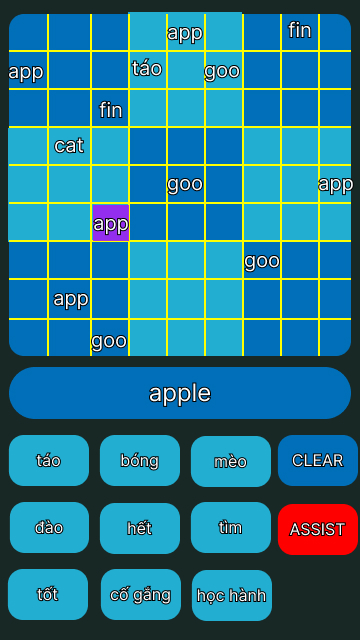

# Iteration 1

## 1. Game Modes

**User story**: As a novice user, I want to be able to choose between two game modes so that I can practice translating from the native language to the foreign one and vice versa.

**TDD example**: On application start-up, the user is presented with a menu to choose between a classic mode (filling in squares with foreign words) or reverse mode (filling in squares with native words).

**Status**: Implemented

## 2. Word List Customization

**User story**: As a language learner, I want to add my own word pairs to the game and choose the pairs to be used in a game so that I can customize the vocabulary I practice.

**TDD example**: On application start-up, the user is presented with a choice in the menu to edit the word list used by the application.

**Status**: Implemented

**TDD example**: After choosing a game mode, the user is prompted to select the word pairs from the added list which will be used in that game.

**Status**: Implemented

## 3. Difficulty Mode

**User Story**: As a language learner, I want to choose the difficulty of the game because I want to choose the appropriate amount of challenge for my language level.

**TDD example**: After choosing a game mode and selecting the word pairs to be used, the user is presented with a difficulty menu of three options: easy, normal, and hard. The harder the game mode, the less pre-filled squares are provided.

**Status**: Implemented

## 4. Interface Mode

**User Story**: As a user, I want to effectively interact with the sudoku board because I want to focus on learning vocabulary instead of struggling with the user interface.

**TDD example**: After adding words, choosing the game mode, and selecting the difficulty, the user will be presented with the 9x9 vocabulary sudoku board, action buttons corresponding to each word, and a “clear” button.

**Status**: Implemented

**TDD example**: In the game screen, the user can fill/clear a square by tapping on the square first, and then on the button of the desired action. Both the action button and the square will be deselected.

**Status**: Implemented

**TDD example**: In the game screen, the user can fill/clear a square by tapping on the button of the desired action first, and then on the square. The cell will be deselected while the action button remain selected.

**Status**: Implemented

## 5. Interface Optimization

**User Story**: As a user, I want to view the word of a square in a separate section on the screen because the word might not fit in its square.

**TDD example**: When the user taps on a square, the word in that square and its translation will be displayed with sufficient space under the sudoku board.

**Status**: Implemented

## 6. Interface Optimization 2

**User Story**: As a novice user, I want the invalid moves to be highlighted so that I can tell when I make a mistake.

**TDD example**: In the game screen, all squares with an invalid word (duplicate in a row, column, or sub-grid) will be highlighted with a red background.

**Status**: Not Implemented

## 7. Interface Optimization 3

**User Story**: As an expert user, I want to play without in-app assistance because I want to challenge myself.

**TDD example**: In the game screen, the user can tap on an “assist” button to toggle assistance, which stops the highlighting of invalid cells and shows only one word of a word pair in the display field.

**Status**: Not Implemented

