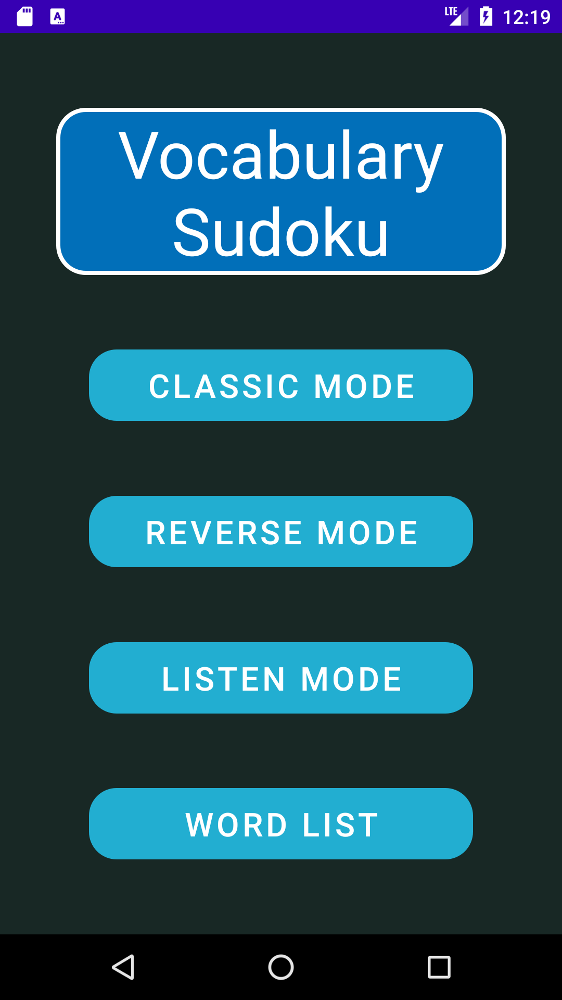
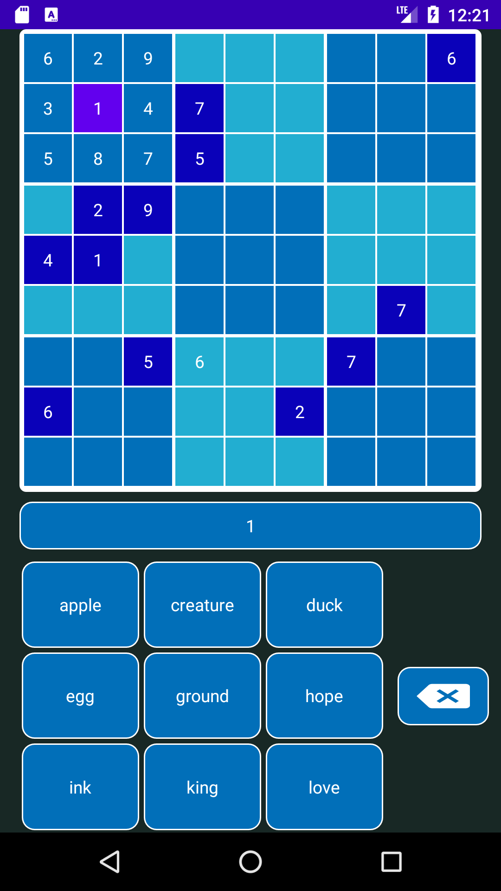

# Iteration 4

## Listening Comprehension Mode

**User Story**: As a student who wants to practice my understanding of spoken words in the language that I am learning, I want a listening comprehension mode. In this mode, numbers will appear in the prefilled cells. When I press the number, the corresponding word in the language that I am learning will be read out to me. I can then test my listening comprehension by selecting from the menu the correct English translation of the word.

**TDD example**: On application start-up, the user will be presented with, in addition to existing options, a choice to enter "Listen Mode"

**Status**: Implemented

**TDD example**: After selecting "Listen Mode" and choosing available customizations in difficulty, board size, and words used, the user is presented with the corresponding Sudoku board and action buttons. The content of the board consist of numbers, similar to a classic Sudoku game. The words in the buttons are English words. The relationship between the words and the numbers are random when initialized, but consistent during gameplay.

**Status**: Implemented

**TDD example**: When the user clicks on a non-empty cell that is not already selected, the sound of the corresponding word will play. The sound will not play when the user is inserting numbers into the grid or when deselecting a cell. A default sound will play if the game cannot find a sound file that matches the word.

**Status**: Implemented

